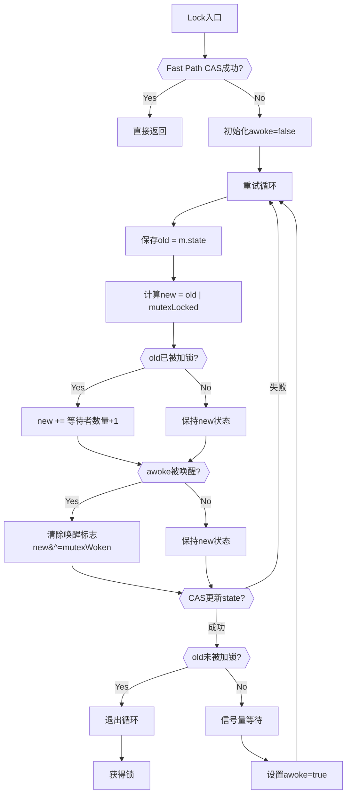

从Go语言诞生以来，Mutex源码有过四版重大改动，本篇内容会参考书中源码，并把自己对前三版源码的理解加在代码注释中。

<!-- more -->

## 初版Mutex

初版Mutex十分简单，通过一个key来标记这个锁是否被goroutine持有，如果被持有，则其他goroutine需要等待。

互斥锁的结构体定义如下：
```go
type Mutex struct {
    // 锁是否被持有的标识
    key  int32
    // 信号量专用，用以阻塞/唤醒goroutine
    sema int32
}
```

如果key值是1，就代表锁已经被持有，那么其他goroutine只能等待；如果key值是0，就可以通过CAS操作将这个key值设置为1，表示锁被当前goroutine持有。

CAS操作（Compare-And-Swap）是一种用于多线程编程的原子操作，用于实现无锁同步机制。其工作原理如下：

1. 比较：首先比较内存中的值与期望值是否相等。
2. 交换：如果相等，则将内存中的值替换为新的值。
3. 返回：返回是否交换成功。

CAS操作的原子性保证这个指令总是基于最新的值进行计算，如果同时有其他线程已经修改了这个值，那么，CAS会返回失败。

这个操作之后我们会详细学习，现在先简单了解一下，定义如下：

```go
// CAS操作，当时还没有抽象出atomic包
func cas(val *int32, old, new int32) bool

// 阻塞等待信号量
func semacquire(sema *int32)

// 释放信号量
func semrelease(sema *int32)
```

加锁和解锁的实现如下：

```go
// 保证成功在val上增加delta的值
func xadd(val *int32, delta int32) (new int32) {
    for {
        // 获取当前key的值
        // 这里就会有两种情况：
        // 1. 当前key的值为0，表示锁未被持有
        // 2. 当前key的值为1，表示锁被其他goroutine持有
        v := *val
        // 在这里CAS操作将新值v+delta与旧值v进行比较，如果相等，则将新值v+delta赋值给val，然后返回新值v+delta
        if cas(val, v, v+delta) {
            return v + delta
        }
    }
    panic("unreached")
}

// 请求锁
func (m *Mutex) Lock() {
    //标识加1，如果等于1，成功获取到锁
    // 如果拿不到锁，则阻塞等待
    if xadd(&m.key, 1) == 1 {
        return
    }
    semacquire(&m.sema) // 否则阻塞等待
}

// 释放锁
func (m *Mutex) Unlock() {
    if xadd(&m.key, -1) == 0 { // 将标识减去1，如果等于0，则没有其它等待者
        return
    }
    semrelease(&m.sema) // 唤醒其它阻塞的goroutine
}    
```

::: important
初版Mutex的原理十分简单，但是有一个问题：

**Unlock方法可以被任意的goroutine调用释放锁，即使是没持有这个互斥锁的goroutine，也可以进行这个操作。**

**这是因为，Mutex本身并没有包含持有这把锁的goroutine信息，所以，Unlock也不会对此进行检查，Mutex的这个设计一直保持至今。**

**因此，我们在开发中一定要遵循“谁加锁，谁释放”的原则，否则，可能会导致 data race 问题。**
:::

## 多给新goroutine一点机会

Go开发者在2011 年 6 月 30 日的 commit 中对 Mutex 做了一次大的调整，调整后的 Mutex 实现如下：

```go
type Mutex struct {
    // 锁是否被持有的标识
    // 第一位表示锁是否被持有
    // 第二位表示锁是否被唤醒
    // 其余位表示等待着的数量

    // 举例：
    // 锁被持有，未被唤醒，有两个等待者
    // 00000000 00000000 00000000 00001001 (1 + 0 + 2<<2 = 9)
    // 锁状态：已锁定（1），未唤醒（0），等待数2

    // 锁未被持有，被唤醒，无等待者
    // 00000000 00000000 00000000 00000010 (0 + 2 + 0 = 2)
    // 锁状态：未锁定（0），已唤醒（1），等待数0

    // 锁未被持有，未被唤醒，有五个等待者
    // 00000000 00000000 00000000 00010100 (0 + 0 + 5<<2 = 20)
    // 锁状态：未锁定（0），未唤醒（0），等待数5
    state int32
    // 信号量专用，用以阻塞/唤醒goroutine
    sema  uint32
}

const (
    // 在const语法块中，iota初始值为0，随着每个常量的定义，iota的值会自动增加1
    // Go默认数字常量为无类型常量，在计算的时候会转换成与其他变量相同的类型（只要在其他变量的范围之内）
    mutexLocked = 1 << iota // 1 << 0 = 1 0b00000001

    // 此标志位表示已有等待者被标记为“即将唤醒”，避免重复唤醒导致不必要的竞争
    mutexWoken // 1 << 1 = 2 0b00000010
    mutexWaiterShift = iota // 2 0b00000010
)
```

Lock操作也变得复杂，复杂之处不仅在与state位运算，而且代码逻辑也十分复杂。

```go
func (m *Mutex) Lock() {
    // 现在有了atomic包，支持CAS操作
    // Fast path: 幸运case，能够直接获取到锁
    // 将state值与0进行比较，如果此时state和0相等，那么把state值设置为1
    if atomic.CompareAndSwapInt32(&m.state, 0, mutexLocked) {
        return
    }

    // 每个goroutine独有的内部变量，记录这个goroutine是否被唤醒
    awoke := false
    // 进入循环，不断地请求锁
    for {
        // 保存当前状态
        old := m.state

        // “尝试”加锁后变成新状态
        // 私自加锁，并且期望能够在接下来的操作中能够抢到锁

        // |：按位或运算符，表示两个值的二进制位进行或运算
        // 举例：
        // 开始状态，old = 0
        // 00000000 00000000 00000000 00000000 (0)
        // | 00000000 00000000 00000000 00000001 (1)
        // = 00000000 00000000 00000000 00000001 (1)

        // 开始状态，old = 9
        // 00000000 00000000 00000000 00001001 (9)
        // | 00000000 00000000 00000000 00000001 (1)
        // = 00000000 00000000 00000000 00001001 (9)
        new := old | mutexLocked

        // 如果条件成立，说明此时的锁已经被其他goroutine持有

        // &：按位与运算符，表示两个值的二进制位进行与运算
        // 举例：
        // 开始状态，old = 0
        // 00000000 00000000 00000000 00000000 (0)
        // & 00000000 00000000 00000000 00000001 (1)
        // = 00000000 00000000 00000000 00000000 (0)

        // 开始状态，old = 9
        // 00000000 00000000 00000000 00001001 (9)
        // & 00000000 00000000 00000000 00000001 (1)
        // = 00000000 00000000 00000000 00000001 (1)
        if old&mutexLocked != 0 {
            // 等待者数量加一

            // 从第三位开始，表示等待者数量，因此+1操作需要左移两位后相加
            // 举例：
            // old = 00000000 00000000 00000000 00001001 (9)
            // 1<<mutexWaiterShift = 00000000 00000000 00000000 00000010 (2)

            // new = 00000000 00000000 00000000 00001011 (11)
            // 等待者数量：截取第三位往后：00000000 00000000 00000000 000010 (3)
            new = old + 1<<mutexWaiterShift
        }

        // 若awoke在信号量解除阻塞后置为true，此goroutine被唤醒
        if awoke {
            // 新状态清除唤醒标志

            // &^：按位与非运算符，先对第二个操作数取非，然后再和第一个操作数按位与
            // 举例：
            // 开始状态，new = 00000000 00000000 00000000 00001011 (11，响应标志位为1)

            // 对第二个操作数（00000000 00000000 00000000 00000010）取非：
            // 11111111 11111111 11111111 11111101

            // 与第一个操作数（00000000 00000000 00000000 00001011）按位与：
            // = 00000000 00000000 00000000 00001000 (8)
            new &^= mutexWoken
        }

        // CAS操作，确保state状态没有被其他goroutine修改
        // 如果没有修改，那么将new值赋值给state
        if atomic.CompareAndSwapInt32(&m.state, old, new) {

            // 此时old&mutexLocked有两种情况
            // 1. 抢锁成功，old&mutexLocked == 0，循环结束
            // 2. 抢锁失败，外层CAS只是更新了waiter数量，并没有修改有锁的标志位，
            //    此时old&mutexLocked != 0，继续循环
            if old&mutexLocked == 0 {
                break
            }

            // 请求信号量，阻塞等待，防止state中的等待者数量无限增长
            // 阻塞到sema能被递减，也就是 sema > 0
            // 唤醒逻辑在Unlock方法中
            runtime.Semacquire(&m.sema)

            // 上方解除阻塞后，设置awoke为true，去争抢锁
            awoke = true
        }
    }
}
```

理解了Lock方法的每一步操作之后，接下来看看整体Lock方法的流程：



释放锁的逻辑如下：

```go
func (m *Mutex) Unlock() {
    // 原子操作，将state值减去mutexLocked，用于去掉锁标志
    // 举例：
    // m.state = 00000000 00000000 00000000 00001001 (9)
    // -mutexLocked = 11111111 11111111 11111111 11111111 (-1) 补码
    // new = 00000000 00000000 00000000 00000110 (8)
    new := atomic.AddInt32(&m.state, -mutexLocked)

    // 如果(new+mutexLocked)&mutexLocked == 0，说明本来就没有加锁
    // 防止没加锁就直接解锁
    // 举例：

    // 有加锁的情况
    // new = 00000000 00000000 00000000 00000110 (8)
    // mutexLocked = 00000000 00000000 00000000 00000001 (1)
    // new+mutexLocked = 00000000 00000000 00000000 00000111 (7)
    // (new+mutexLocked)&mutexLocked = 00000000 00000000 00000000 00000001 (1)

    // 没有加锁的情况
    // new = 00000000 00000000 00000000 00000110 (8)
    // mutexLocked = 00000000 00000000 00000000 00000001 (1)
    // new+mutexLocked = 00000000 00000000 00000000 00000111 (7)
    // (new+mutexLocked)&mutexLocked = 00000000 00000000 00000000 00000000 (0)
    if (new+mutexLocked)&mutexLocked == 0 {
        panic("sync: unlock of unlocked mutex")
    }

    // 保存去掉锁标志的状态
    old := new
    // 
    for {
        // 如果所有条件成立，那么直接返回，解锁成功

        // 如果 old>>mutexWaiterShift == 0，说明没有等待者，对这个锁的竞争的 goroutine 只有一个
        // 举例：mutexWaiterShift = 2

        // 有等待者的情况
        // old = 00000000 00000000 00000000 00001001 (9)
        // old>>mutexWaiterShift = 00000000 00000000 00000000 00000010 (2)
        // 没有等待者的情况
        // old = 00000000 00000000 00000000 00000000 (0)
        // old>>mutexWaiterShift = 00000000 00000000 00000000 00000000 (0)

        // 如果 old&(mutexLocked|mutexWoken) != 0，说明有唤醒的waiter，或者锁原来已加锁
        // mutexLocked被置位：说明当前锁已被其他 goroutine 重新获取，此时解锁操作不应唤醒其他等待者，否则会破坏互斥性
        // mutexWoken被置位：说明已有等待者被标记为“即将唤醒”（例如其他Unlock操作已触发唤醒）。此时重复唤醒会导致不必要的竞争
    
        // 成功的情况 - 此时有其他goroutine持有锁
        // old = 00000000 00000000 00000000 00001001 (9)
        // mutexLocked|mutexWoken = 00000000 00000000 00000000 00000011 (3)
        // old&(mutexLocked|mutexWoken) = 00000000 00000000 00000000 00000001 (1) 不为1

        // 成功的情况 - 此时已有等待者被标记为“即将唤醒”
        // old = 00000000 00000000 00000000 00001010 (10)
        // mutexLocked|mutexWoken = 00000000 00000000 00000000 00000011 (3)
        // old&(mutexLocked|mutexWoken) = 00000000 00000000 00000000 00000010 (2) 不为1

        // 所有条件不成立的情况 此时有多位等待者，并且锁还没有被获取或者其他等待者已经被标记为“即将唤醒”
        if old>>mutexWaiterShift == 0 || old&(mutexLocked|mutexWoken) != 0 {
            return
        }

        // 减少一个等待者，并且增加唤醒标志，让唤醒的goroutine优先获得到锁
        // old = 00000000 00000000 00000000 00001000 (8)
        // -1<<mutexWaiterShift = 11111111 11111111 11111111 11111100 (-4)
        // new = 00000000 00000000 00000000 00000110 (6)
        new = (old - 1<<mutexWaiterShift) | mutexWoken
        // 原子操作，保证state状态没有被其他goroutine修改
        if atomic.CompareAndSwapInt32(&m.state, old, new) {

            // 成功则释放信号量，唤醒正在等待获取锁的goroutine
            runtime.Semrelease(&m.sema)
            return
        }

        // 如果CAS操作失败，则重试
        old = m.state
    }
}
```

::: important
看完整个代码的逻辑，心中还有一个疑问：为什么新来的goroutine也有机会获取到锁呢？

答案就这一版涉及中的快速路径（Fast Path）和竞争机制。

1. 快速路径

- **锁未被持有时的直接获取**

当新来的goroutine调用`Lock()`时，首先会尝试通过`atomic.CompareAndSwapInt32(&m.state, 0, mutexLocked)`直接获取锁。

如果此时锁恰好处于未加锁状态（`m.state`为0），新goroutine会立即获取锁，无需进入等待队列。

2. 竞争机制

- **锁释放时的竞争**

当持有锁的goroutine调用`Unlock()`时，它会通过`runtime.Semrelease(&m.sema)`唤醒一个等待的goroutine。

然而，**锁状态的更新和唤醒操作是分离的**：

    1. `Unlock()`会将锁状态`m.state`的`mutexLocked`位清除。

    2. 接着尝试唤醒一个等待的goroutine，在锁状态更新后、唤醒`runtime.Semacquire(&m.sema)`操作完成前，
    新来的goroutine可能通过快速路径直接获取锁，从而插队成功。

- **CAS操作的原子性**

在所释放的竞争时，CAS操作保证了**谁先执行成功，谁就能获取到锁**，而新goroutine可能因为调度时机更优而胜出。

另外，仔细体会理解代码之后还有一个疑点，就是`runtime.Semacquire(&m.sema)`和`runtime.Semrelease(&m.sema)`的实现，这里简单介绍一下Go信号量的实现原理：

Go的`Mutex`信号量**同时依赖用户态和内核态机制**：

    - 用户态：通过原子操作、自旋、协程调度避免频繁内核切换。
    
    - 内核态：在竞争激烈或长时间阻塞时，通过`futex`等系统调用让OS线程休眠。
:::

## 多给竞争者一些机会

在2015年2月的改动中，如果新来的goroutine或者是被唤醒的goroutine首次获取不到锁，它们就会通过自旋（spin，通过CPU处理器让出一定的周期循环不断尝试）的方式，尝试检查锁是否被释放。

在尝试一定的自旋次数后，再执行原来的逻辑。

```go
func (m *Mutex) Lock() {
    // Fast path: 幸运之路，正好获取到锁
    if atomic.CompareAndSwapInt32(&m.state, 0, mutexLocked) {
        return
    }

    awoke := false
    iter := 0
    for {
        old := m.state
        new := old | mutexLocked

        // 锁还没被释放
        if old&mutexLocked != 0 {
            // 检测此goroutine是否可以自旋
            if runtime_canSpin(iter) {
                
                // 条件梳理：
                // 1. !awoke：awoke为false，说明此goroutine没有被唤醒
                // 2. old&mutexWoken == 0：说明锁没有被唤醒
                // 3. old>>mutexWaiterShift != 0：说明有等待者
                // 4. CAS操作，判断state是否被其他goroutine修改，如果没有被修改，则将mutexWoken标志位设置为1
                if !awoke && old&mutexWoken == 0 && old>>mutexWaiterShift != 0 &&
                    atomic.CompareAndSwapInt32(&m.state, old, old|mutexWoken) {

                    // 尝试标记锁为“唤醒”状态
                    // 告知锁持有者在释放时直接传递给自旋协程，避免唤醒其他休眠协程，减少上下文切换
                    awoke = true
                }
                // 自旋（通常通过CPU的PAUSE指令）
                runtime_doSpin()
                // 计数器+1
                iter++
                // 继续自旋
                continue
            }

            // 自旋结束后还没有拿到锁，则将等待者数量+1，准备进入等待队列
            new = old + 1<<mutexWaiterShift
        }

        // 原来代码逻辑
        if awoke {
            if new&mutexWoken == 0 {
                panic("sync: inconsistent mutex state")
            }
            new &^= mutexWoken // 新状态清除唤醒标记
        }
        if atomic.CompareAndSwapInt32(&m.state, old, new) {
            if old&mutexLocked == 0 {
                break
            }
            runtime_Semacquire(&m.sema)
            awoke = true
            iter = 0
        }
    }
}
```


下面举一个协程调用`Lock()`的例子，来帮助理解自旋的逻辑：

1. 初始状态

- 二进制：`00000000 00000000 00000000 00000101`（十进制`5`）
- 分解：
    - `mutexLocked（第0位）` = `1`（锁被持有）
    - `mutexWoken（第1位）` = `0`（未有goroutine被唤醒）
    - `mutexWaiterShift（第2位）` = `1`（等待者数量）

2. 首次尝试获取锁

- 协程尝试通过CAS将`state`从`5`修改为`5|mutexLocked`（即设置锁标志位），但锁已被持有（`mutexLocked=1`），CAS失败。

- 进入自旋逻辑

3. 检查自旋条件

- `runtime_canSpin(iter)`：

    - 假设首次调用`iter=0`，若满足多核CPU条件，允许自旋。

- 进入自旋分支

4. 尝试设置`mutexWoken`

- 条件检查`!awoke && old&mutexWoken == 0 && old>>mutexWaiterShift != 0`：

    - `!awoke` -> `true` （初始 `awoke = false`）
    - `old&mutexWoken` -> `5 & 2 == 0`（满足）
    - `old>>2 == 1 !=0`（满足）
- CAS操作
  - 尝试将`state`从`5`更新为`5 | 2 = 7`（即设置 `mutexWoken = 1`）。
  - **成功**：`awoke = true`，当前协程标记为已唤醒。
  - **新状态**：`7`（二进制 `00000000 00000000 00000000 00000111`）。

5. 执行自旋

- `runtime_doSpin()`：消耗CPU时间（例如循环执行 `PAUSE` 指令）。
- `iter++` --> `iter == 1`。
- `continue` 回到循环开始，重新读取 `state`。

6. 后续循环尝试
   1. 第二次循环
      - 当前状态：`7`（`mutexLocked == 1`、`mutexWoken == 1`，等待者 `7>>2 == 1`）
      - 尝试设置 `mutexWoken`：
        - 条件 `old&mutexWoken == 0` --> `7 & 2 == 2 != 0` --> 不满足，跳过设置。
      - 继续自旋，`iter = 2`。
   2. 第三次循环：
      - 状态未变，自旋条件同上，`iter = 3`。
   3. 第四次循环
      - `iter = 4`，超过自旋阈值（默认4次），退出自旋。

6. 增加等待者计数

- 计算新状态`new = old + 1<<mutexWaiterShift` --> `7 + (1<<2) == 7 + 4 == 11`
  - 二进制：`00000000 000000000 000000000 00001011`（十进制`11`）
  - 分解：
    - `mutexLocked == 1`（锁仍被持有）
    - `mutexWoken == 1`（唤醒标志保留）
    - 等待者数量：`11 >> 2 == 2`（新增当前协程为第2个等待者）

7. 更新 `state`

- 通过CAS将`state`从`7`修改为`11`：
  - 若成功：当前协程进入等待队列，等待唤醒
  - 若失败（例如锁已经被释放或者状态变更）：重新循环尝试

::: tip
如果是自旋获取锁成功的话，那么就不会满足`old&mutexLocked != 0`条件，也就不会进入自旋逻辑，而是直接返回。
:::

## 总结

至此，前三个版本的源码就分析完了，经过这三版源码的演变，Mutex的实现越来越复杂，应对高并发争抢锁的场景也更加公平，但是会有一个极端情况：

因为新来的goroutine也参与竞争，有可能每次都会被新来的goroutine抢到锁，那么等待中的goroutine可能会一直获取不到锁，这就是**饥饿问题**。

Mutex决不允许这种情况发生，因此从第四版开始，增加了饥饿模式。在不断地优化中，代码最终来到了第四版，第四版在下篇博客内容中会详细介绍。

有了先前state标志位是如何变化的铺垫，第四版源码会更容易理解。

::: info

封面来源: [Pixiv](https://www.pixiv.net/artworks/93595847) <br>
参考资料: [《深入理解Go并发编程》](https://item.jd.com/14283252.html)

:::


