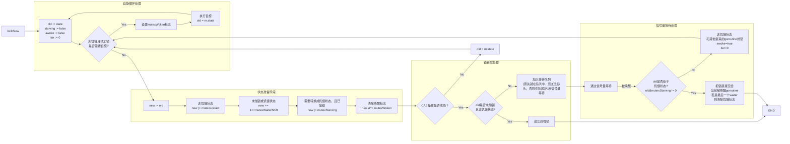

虽然现在Mutex的源码已经复杂到几乎不可读了，但是作为并发编程的入门，我们还是要细细品味。

同时，我们需要理解Mutex的宗旨：Mutex 绝不容忍一个 goroutine 被落下，永远没有机会获取锁。不抛弃不放弃是它的宗旨，而且它也尽可能地让等待较长的 goroutine 更有机会获取到锁。

<!-- more -->

## 解决饥饿

在第四版中，Mutex 引入了饥饿模式，在state中新增了一个状态位`mutexStarving`：

```go
type Mutex struct {
    state int32
    sema uint32
}

const (
    // 举例：一个饥饿的goroutine等待获取锁
    // 00000000 00000000 00000000 00001101
    // 第一位 1 表示有goroutine持有锁
    // 第二位 0 表示没有goroutine被唤醒
    // 第三位 1 表示Mutex管理下的goroutine中有goroutine处于饥饿状态
    // 第四位及其后位 1 表示等待者为1
    mutexLocked = 1 << iota // 加锁状态 1 << 0 == 1
    mutexWoken // 唤醒状态 1 << 1 == 2
    mutexStarving // 饥饿状态 1 << 2 == 4
    mutexWaiterShift = iota // 等待者计数器 3

    // 饥饿阈值，1ms
    // 若一个goroutine等待时间超过该阈值，则进入饥饿模式
    starvationThresholdNs = 1e6
)
```

有了之前的铺垫，对于Mutex定义以及标志位的理解还是挺简单了，重点还是在Mutex的加锁和解锁过程，`Lock()`函数源码如下：

```go
func (m *Mutex) Lock() {
    // Fast path: 幸运之路，一下就获取到了锁
    if atomic.CompareAndSwapInt32(&m.state, 0, mutexLocked) {
        return
    }

    // Slow path：缓慢之路，尝试自旋竞争或饥饿状态下饥饿goroutine竞争
    // 单独封装了lockSlow()函数，用于处理加锁的慢路径
    m.lockSlow()
}

func (m *Mutex) lockSlow() {
    // 初始化等待时间
    var waitStartTime int64
    // 当前goroutine的饥饿标记
    starving := false
    // 当前goroutine的唤醒标记
    awoke := false
    // 此goroutine自旋次数
    iter := 0
    // 保存当前锁的状态
    old := m.state
    for {
        // old&(mutexLocked|mutexStarving) == mutexLocked 表示当前锁是非饥饿状态，锁还没被释放
        // runtime_canSpin(iter) 表示当前goroutine可以自旋

        // 如果条件不成立，那么有以下情况（if之后的代码就是处理下面这些情况的）：
        // 1. 此goroutine自旋次数过多或者不允许自旋
        // 2. 锁下有goroutine处于饥饿状态
        // 3. 当前没有goroutine持有锁
        if old&(mutexLocked|mutexStarving) == mutexLocked && runtime_canSpin(iter) {

            // 如果当前goroutine没有被唤醒，并且锁没有被唤醒，并且等待者数量不为0，则尝试唤醒goroutine
            if !awoke && old&mutexWoken == 0 && old>>mutexWaiterShift != 0 &&
                atomic.CompareAndSwapInt32(&m.state, old, old|mutexWoken) {

                // 尝试设置唤醒标记
                awoke = true
            }
            // 自旋
            runtime_doSpin()
            iter++
            old = m.state // 再次获取锁的状态，之后会检查是否锁被释放了
            continue
        }
        // 保存旧状态
        new := old
        // 如果锁不是饥饿状态，则加锁
        if old&mutexStarving == 0 {
            // 原版源码逻辑——尝试加锁
            new |= mutexLocked
        }

        // 这里可以理解为：
        // 1. 如果锁被加锁，则waiter数量加1（第三版源码逻辑）
        // 2. 若Mutex管理的goroutine中有goroutine处于饥饿状态，那么其他goroutine会直接放入等待队列（新加的逻辑）
        if old&(mutexLocked|mutexStarving) != 0 {
            new += 1 << mutexWaiterShift
        }
        // 如果当前goroutine处于饥饿状态，并且锁被加锁，则设置饥饿状态
        if starving && old&mutexLocked != 0 {
            new |= mutexStarving
        }

        // 如果当前goroutine被唤醒，则清除唤醒标记
        if awoke {
            // 非法值校验
            if new&mutexWoken == 0 {
                throw("sync: inconsistent mutex state")
            }
            // 清除唤醒标记
            new &^= mutexWoken
        }

        // 将m.state值与Old比较，如果相等，则将m.state值设置为new，成功更新状态
        if atomic.CompareAndSwapInt32(&m.state, old, new) {
            // old的状态可能是自旋最后获取到的，因此需要检查自旋后锁是否被释放
            // 原来锁的状态已释放，并且不是饥饿状态，正常请求到了锁，返回

            // 如果条件不成立，这同样有两种情况：
            // 1. 锁未被释放，那么后续处理需要等待
            // 2. 有goroutine处于饥饿状态，那么需要将当前goroutine加入到等待队列中
            if old&(mutexLocked|mutexStarving) == 0 {
                break // locked the mutex with CAS
            }

            // queueLifo 表示信号量插入队列的方式
            queueLifo := waitStartTime != 0
            // 如果waitStartTime为0，则设置为当前时间
            if waitStartTime == 0 {
                waitStartTime = runtime_nanotime()
            }

            // 阻塞等待（这个函数的说明在代码下方）
            // 如果queueLifo为true，将当前goroutine插入队列头
            // 如果queueLifo为false，将当前goroutine插入队列尾
            runtime_SemacquireMutex(&m.sema, queueLifo, 1)

            // 唤醒之后检查锁是否应该处于饥饿状态
            // 两次时间相减，如果大于饥饿阈值，则设置饥饿状态
            starving = starving || runtime_nanotime()-waitStartTime > starvationThresholdNs

            // 此时old的值已经是goroutine进入等待之间的状态了，这个变量的值已经过期
            // 因此此变量用于重新保存当前m.state的值
            old = m.state

            // // 如果锁已经处于饥饿状态，直接抢到锁，返回
            // m.state在CAS的时候已经更新为new，而new在满足饥饿条件的时候会加上饥饿标记
            // 因此old&mutexStarving != 0 表示锁处于饥饿状态
            // 注意：此时m.state最新的状态为old，new为CAS后的状态
            if old&mutexStarving != 0 {

                // 非法值校验：如果锁被加锁或者被唤醒，或者等待者数量为0，则抛出异常
                if old&(mutexLocked|mutexWoken) != 0 || old>>mutexWaiterShift == 0 {
                    throw("sync: inconsistent mutex state")
                }
                // 有点绕，加锁并且将waiter数减1
                // 举例：
                // mutexLocked == 1
                // mutexWaiterShift == 3
                // 1 - 1<<3 = -7 = 11111111 11111111 11111111 11111001
                delta := int32(mutexLocked - 1<<mutexWaiterShift)

                // 最后一个waiter或者已经不饥饿了，清除饥饿标记
                // 如果条件不成立，说明此时Mutex管理的goroutine中不止这个goroutine处于饥饿状态
                if !starving || old>>mutexWaiterShift == 1 {
                    delta -= mutexStarving
                }

                // 更新状态，也就是把锁的位设置为1，Mutex已处于加锁状态，结束for循环，此goroutine直接获取到锁
                atomic.AddInt32(&m.state, delta)
                break
            }
            // 将此goroutine标记为“即将唤醒”状态
            awoke = true
            // 重置自旋次数
            iter = 0
        } else {
            // 如果操作失败，更新状态，重新抢锁
            old = m.state
        }
    }
}
```

::: important

- `runtime.nanotime()`：返回当前的时间（纳秒）

此函数返回当前时间类型为**单调时间**，即从某个固定时间点开始计算的纳秒数，不受系统时间变化的影响。

对比`time.Since()`，`runtime.nanotime()`是运行时内部使用的轻量级函数，而`time.Since()`是用户态的函数，性能上会快一些。

- `runtime_SemacquireMutex()`

核心作用：
1. 阻塞等待信号量

当 goroutine 尝试获取一个已被其他 goroutine 持有的信号量时，该函数会阻塞等待，直到信号量被释放。

2. 与调度器协作

该函数会主动让出当前 goroutine 对 CPU 的控制权，允许调度器切换到其他 goroutine，从而避免忙等待（Busy Waiting），提高 CPU 的利用率。

3. 处理锁的饥饿模式

在 Mutex 的饥饿模式下（即某个 goroutine 长时间无法获取锁），`runtime_SemaacquireMutex` 会调整等待队列的行为，确保等待时间最长的 goroutine 优先获取锁（FIFO模式），避免饥饿问题。

函数签名：

```go
func runtime_SemacquireMutex(s *uint32, lifo bool, skipframes int)
```

参数说明：
- `s *uint32`：指向信号量的指针。
- `lifo bool`：表示是否使用LIFO（Last In First Out）队列。true表示使用LIFO模式，false表示使用FIFO模式。
- `skipframes int`：表示跳过多少个栈帧。

问：`lifo`为false代表锁处于饥饿模式吗？

答：不是。锁处于饥饿模式是与锁管理的所有goroutine有关，而不是与等待队列的类型有关。`lifo`的值只表示此次进入队列的goroutine的插队模式是LIFO还是FIFO。

:::

整个`lockSlow()`函数的流程图如下：



`lockSlow()`绝对是整个Mutex源码最复杂的部分了，解决完`lockSlow()`，那么下面要说明的`unlockSlow()`就简单多了，主要是对`lockSlow()`的补充。

`unlockSlow()`函数源码如下：

```go
func (m *Mutex) Unlock() {
    // Fast path: drop lock bit.
    new := atomic.AddInt32(&m.state, -mutexLocked)
    if new != 0 {
        m.unlockSlow(new)
    }
}

func (m *Mutex) unlockSlow(new int32) {
    // 校验非法值
    if (new+mutexLocked)&mutexLocked == 0 {
        throw("sync: unlock of unlocked mutex")
    }

    // 如果锁不是饥饿状态
    if new&mutexStarving == 0 {
        old := new
        for {
            // 如果等待者数量为0，或者锁被加锁，或者锁被唤醒，或者锁处于饥饿状态，则返回（原有逻辑上加了饥饿状态的判断）
            if old>>mutexWaiterShift == 0 || old&(mutexLocked|mutexWoken|mutexStarving) != 0 {
                return
            }

            // 否则，waiter数量减1，mutexWoken标志设置上，通过CAS更新state的值
            new = (old - 1<<mutexWaiterShift) | mutexWoken
            if atomic.CompareAndSwapInt32(&m.state, old, new) {
                runtime_Semrelease(&m.sema, false, 1)
                return
            }
            old = m.state
        }
    } else {
        // 如果锁处于饥饿状态，则通过信号量直接释放锁
        // 这样设计是为了让饥饿的goroutine尽快获取到锁
        // 直接释放也不怕饥饿的goroutine拿不到锁，因为在lockSlow()中，饥饿的goroutine会直接获取到锁
        runtime_Semrelease(&m.sema, true, 1)
    }
}
```

## 总结

引用老师的一句话：“罗马不是一天建成的”，Mutex 的设计也是从简单设计到复杂处理逐渐演变的。

初版的 Mutex 设计非常简洁，充分展示了 Go 创始者的简单、简洁的设计哲学。但是，随着大家的使用，逐渐暴露出一些缺陷，为了弥补这些缺陷，Mutex 不得不越来越复杂。

通过了解源码我们也可以得知，为了20%的特性，可能需要添加80%的代码，这也是程序越来越复杂的原因。因此，在设计程序时，我们一定要有一个清晰且易于拓展的设计。

::: info

封面来源: [Pixiv](https://www.pixiv.net/artworks/128316730) <br>
参考资料: [《深入理解Go并发编程》](https://item.jd.com/14283252.html)

:::