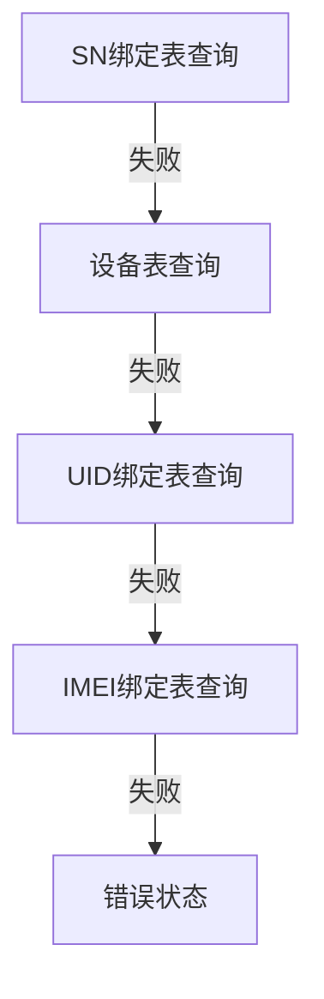

状态模式（State Pattern），当一个对象的内在状态改变时允许改变其行为，这个对象看起来像是改变了其类。

<!-- more -->

## 书中案例实现

情景：从早到晚工作的状态切换

### UML 类图

@startuml
left to right direction 

interface State {
    +writeProgram(work: Work): void
}

class ForenoonState {
    +writeProgram(work: Work): void
}

class NoonState {
    +writeProgram(work: Work): void
}

class AfternoonState {
    +writeProgram(work: Work): void
}

class EveningState {
    +writeProgram(work: Work): void
}

class RestState {
    +writeProgram(work: Work): void
}

class SleepingState {
    +writeProgram(work: Work): void
}

class Work {
    -state: State
    +hour: number
    +finish: boolean
    +setState(state: State): void
    +writeProgram(): void
}

State <|.. ForenoonState
State <|.. NoonState
State <|.. AfternoonState
State <|.. EveningState
State <|.. RestState
State <|.. SleepingState

Work o-- State
Work <.. State
@enduml

## 代码实现

::: tabs

@tab TypeScript

定义一个`State`状态接口，包含一个`writeProgram`方法，接受一个`Work`对象作为参数。

```ts
// 状态接口
interface State {
    writeProgram(work: Work): void;
}
```

上午和中午工作状态类：

```ts
// 上午工作状态
class ForenoonState implements State {

    public writeProgram(work: Work): void {

        if (work.getHour() < 12) {
            console.log(`当前时间：${work.getHour()}点 上午工作，精神百倍`);
        } else {
            work.setState(new NoonState()); // 超过12点，转入中午工作状态
            work.writeProgram();
        }
    }
}

// 中午工作状态
class NoonState implements State {

    public writeProgram(work: Work): void {

        if (work.getHour() < 13) {
            console.log(`当前时间：${work.getHour()}点 饿了，午饭；犯困，午休`);
        } else {
            work.setState(new AfternoonState()); // 超过13点转入下午工作状态
            work.writeProgram();
        }
    }
}
```

下午和晚间工作状态类：

```ts
// 下午工作状态
class AfternoonState implements State {

    public writeProgram(work: Work): void {

        if (work.getHour() < 17) {
            console.log(`当前时间：${work.getHour()}点 下午状态还不错，继续努力`);
        } else {
            work.setState(new EveningState()); // 超过17点，转入晚间工作状态
            work.writeProgram();
        }
    }
}

// 晚间工作状态
class EveningState implements State {

    public writeProgram(work: Work): void {

        if (work.getWorkFinished()) {
            work.setState(new RestState()); // 如果工作完成，转入下班状态
            work.writeProgram();
        } else {
            if (work.getHour() < 21) {
                console.log(`当前时间：${work.getHour()}点 加班哦，疲累之极`);
            } else {
                work.setState(new SleepingState()); // 超过21点，转入睡眠工作状态
                work.writeProgram();
            }
        }
    }
}
```

睡眠状态和下班休息状态类：

```ts
// 下班休息状态
class RestState implements State {

    public writeProgram(work: Work): void {
        console.log(`当前时间：${work.getHour()}点 下班回家了`);
    }
}

// 睡眠状态
class SleepingState implements State {

    public writeProgram(work: Work): void {
        console.log(`当前时间：${work.getHour()}点 不行了，睡着了`);
    }
}
```

工作类：

```ts
// 工作类
class Work {
    private current: State;

    // 钟点属性，状态转换的依据
    private hour: number;

    // 工作完成与否属性，是否能下班的依据
    private workFinished: boolean;

    constructor() {
        // 初始化状态
        this.current = new ForenoonState();
    }

    public setState(state: State): void {
        // 设置当前状态
        this.current = state
    }

    public getHour(): number {
        return this.hour;
    }

    public setHour(value: number): void {
        this.hour = value;
    }

    public writeProgram() {
        // 显示当前状态，并切换下一个状态
        this.current.writeProgram(this);
    }

    public getWorkFinished(): boolean {
        return this.workFinished;
    }

    public setWorkFinished(value: boolean): void {
        this.workFinished = value;
    }
}
```

客户端代码：

```ts
// 客户端代码
(async () => {
    const emergencyProjects = new Work();
    emergencyProjects.setHour(9);
    emergencyProjects.writeProgram();

    emergencyProjects.setHour(10);
    emergencyProjects.writeProgram();

    emergencyProjects.setHour(12);
    emergencyProjects.writeProgram();

    emergencyProjects.setHour(13);
    emergencyProjects.writeProgram();

    emergencyProjects.setHour(14);
    emergencyProjects.writeProgram();

    emergencyProjects.setHour(17);
    emergencyProjects.writeProgram();

    emergencyProjects.setWorkFinished(true);
    emergencyProjects.writeProgram();

    emergencyProjects.setHour(19);
    emergencyProjects.writeProgram();

    emergencyProjects.setHour(22);
    emergencyProjects.writeProgram();
})();
```

输出如下：

```
当前时间：9点 上午工作，精神百倍
当前时间：10点 上午工作，精神百倍
当前时间：12点 饿了，午饭；犯困，午休
当前时间：13点 下午状态还不错，继续努力
当前时间：14点 下午状态还不错，继续努力
当前时间：17点 加班哦，疲累之极
当前时间：17点 下班回家了
当前时间：19点 下班回家了
当前时间：22点 下班回家了
```

@tab Golang

定义一个`State`状态接口，包含一个`writeProgram`方法，接受一个`Work`对象作为参数。

```go
// State 状态接口
type State interface {
	writeProgram(work *Work)
}
```

上午和中午工作状态结构体：

```go
// Forenoon 上午工作状态
type Forenoon struct{}

func (f *Forenoon) writeProgram(work *Work) {
	if work.Hour < 12 {
		fmt.Printf("当前时间：%d点 上午工作，精神百倍\n", work.Hour)
	} else {
		work.SetState(&Noon{})
		work.WriteProgram()
	}
}

// Noon 中午工作状态
type Noon struct{}

func (n *Noon) writeProgram(work *Work) {
	if work.Hour < 13 {
		fmt.Printf("当前时间：%d点 饿了，午饭；犯困，午休\n", work.Hour)
	} else {
		work.SetState(&Afternoon{})
		work.WriteProgram()
	}
}
```

下午和晚间工作状态结构体：

```go
// Afternoon 下午工作状态
type Afternoon struct{}

func (a *Afternoon) writeProgram(work *Work) {
	if work.Hour < 17 {
		fmt.Printf("当前时间：%d点 下午状态还不错，继续努力\n", work.Hour)
	} else {
		work.SetState(&Evening{})
		work.WriteProgram()
	}
}

// Evening 晚间工作状态
type Evening struct{}

func (e *Evening) writeProgram(work *Work) {
	if work.TaskFinished {
		work.SetState(&Rest{})
		work.WriteProgram()
	} else {
		if work.Hour < 21 {
			fmt.Printf("当前时间：%d点 加班哦，疲累之极\n", work.Hour)
		} else {
			work.SetState(&Sleeping{})
			work.WriteProgram()
		}
	}
}
```

睡眠状态和下班休息状态结构体：

```go
// Sleeping 睡眠状态
type Sleeping struct{}

func (s *Sleeping) writeProgram(work *Work) {
	fmt.Printf("当前时间：%d点 不行了，睡着了\n", work.Hour)
}

// Rest 下班休息状态
type Rest struct{}

func (r *Rest) writeProgram(work *Work) {
	fmt.Printf("当前时间：%d点 下班回家了\n", work.Hour)
}
```

工作结构体：

```go
// Work 工作类
type Work struct {
	Hour         int
	TaskFinished bool
	state        State
}

// NewWork 实例化工作类
func NewWork() *Work {
	return &Work{state: &Forenoon{}}
}

// SetState 设置工作状态
func (w *Work) SetState(state State) {
	w.state = state
}

// WriteProgram 写程序
func (w *Work) WriteProgram() {
	w.state.writeProgram(w)
}
```

客户端代码：

```ts
// 客户端代码
func main() {
	emergencyProjects := state.NewWork()

	emergencyProjects.Hour = 9
	emergencyProjects.WriteProgram()

	emergencyProjects.Hour = 10
	emergencyProjects.WriteProgram()

	emergencyProjects.Hour = 12
	emergencyProjects.WriteProgram()

	emergencyProjects.Hour = 13
	emergencyProjects.WriteProgram()

	emergencyProjects.Hour = 14
	emergencyProjects.WriteProgram()

	emergencyProjects.Hour = 17
	emergencyProjects.WriteProgram()

	emergencyProjects.TaskFinished = false
	emergencyProjects.Hour = 19
	emergencyProjects.WriteProgram()

	emergencyProjects.Hour = 22
	emergencyProjects.WriteProgram()
}
```

输出如下：

```
当前时间：9点 上午工作，精神百倍
当前时间：10点 上午工作，精神百倍
当前时间：12点 饿了，午饭；犯困，午休
当前时间：13点 下午状态还不错，继续努力
当前时间：14点 下午状态还不错，继续努力
当前时间：17点 加班哦，疲累之极
当前时间：17点 下班回家了
当前时间：19点 下班回家了
当前时间：22点 下班回家了
```

:::

## 思考

> 1. 为什么要使用状态模式？

笑死，上一段原先的代码就知道一堆嵌套if-else的痛苦了

```go
type Work struct {
    Hour         int
    TaskFinished bool
}

func (w *Work) WriteProgram() {
    if w.Hour < 12 {
        fmt.Printf("当前时间：%d点 上午工作，精神百倍\n", w.Hour)
    } else if w.Hour < 13 {
        fmt.Printf("当前时间：%d点 饿了，午饭；犯困，午休\n", w.Hour)
    } else if w.Hour < 17 {
        fmt.Printf("当前时间：%d点 下午状态还不错，继续努力\n", w.Hour)
    } else {
        if w.TaskFinished {
            fmt.Printf("当前时间：%d点 下班回家了\n", w.Hour)
        } else {
            if w.Hour < 21 {
                fmt.Printf("当前时间：%d点 加班哦，疲累之极\n", w.Hour)
            } else {
                fmt.Printf("当前时间：%d点 不行了，睡着了\n", w.Hour)
            }
        }
    }
}
```

层层嵌套的if-else语句会使代码的可读性特别差，因此状态模式就是为了解决这个问题而生的。

> 2. 状态模式的好处？

状态模式的好处是将与特定状态相关的行为局部化，并且将不同状态的行为分割开来，满足“单一职责原则”，其目的是为了消除庞大的分支语句。

> 3. 如何使用状态模式？

- 定义一个状态接口，接口中定义一个所有状态共有的方法。

- 实现具体的状态类，每个状态类实现状态接口中的方法，同时根据具体的业务逻辑进行相应的处理，或者切换到下一个状态。

真实案例：MES生产系统中有一个过程追溯的概念，用户会向后端发来一个`code`字段，这个`code`字段可能的值如下：

- SN码: snCode
- 设备码：deviceCode
- UID码：uidCode
- IMEI码：imeiCode

根据不同的`code`字段的值，后端会根据 SN码 -> 设备码 -> UID码 -> IMEI码 的顺序进行查询，最终查询到设备信息。

具体逻辑：

- 先查SN和设备码绑定表，如果查得到那么返回设备码再查设备信息。

- 如果SN和设备码绑定表查不到，那么查设备表，如果查得到那么返回设备信息。

- 如果设备表查不到，那么查UID和设备码绑定表，如果查得到那么返回设备码再查设备信息。

- 如果UID和设备码绑定表查不到，那么查IMEI和SN码绑定表，再通过SN查设备码，最后通过设备码查设备信息。

- 如果以上都查不到，那么报错。

解决方案：

- 整体流程



- 代码实现

```ts
// 状态接口
interface TraceState {
    handle(context: TraceContext): void;
}

// 上下文类
class TraceContext {
    private state: TraceState;

    private readonly code: string;

    private device: DeviceEntity;

    private error: Error;

    constructor(code: string) {
        this.code = code;
        this.state = new SNBindState();
    }

    public start(): void {
        while (!state && !(state instanceof ErrorState)) {
            this.state.handle(this);

            if (device != null || error != null) {
                break;
            }
        }
    }

    // setter、getter 忽略
}

// SN码绑定状态
class SNBindState implements TraceState {
    public handle(context: TraceContext): void {
        // 模拟查询SN码绑定表
        const snBind = await querySNBind(context.code);
        if (snBind) {
            // 查询到设备信息
            const device = await queryDevice(snBind.deviceCode);
            if (device) {
                context.setDevice(device);
                return;
            }
        }

        // 如果查询不到绑定表则切换到设备状态
        context.setState(new DeviceState());
    }
}

// 设备状态
class DeviceState implements TraceState {
    public handle(context: TraceContext): void {
        // 模拟查询设备表
        const device = await queryDevice(context.code);

        if (device) {
            // 查询到设备信息
            context.setDevice(device);
            return;
        }

        // 如果查询不到设备表则切换到UID状态
        context.setState(new UIDState());
    }
}

// UID状态
class UIDState implements TraceState {
    public handle(context: TraceContext): void {
        // 模拟查询UID绑定表
        const uidBind = await queryUIDBind(context.code);
        if (!uidBind) {
            const device = await queryDevice(uidBind.deviceCode);
        }

        // 如果查询不到UID绑定表则切换到IMEI状态
        context.setState(new IMEIState());
    }
}

// IMEI状态
class IMEIState implements TraceState {
    public handle(context: TraceContext): void {
        // 模拟查询IMEI绑定表
        const imeiBind = await queryIMEIBind(context.code);
        if (imeiBind) {
            // 模拟查询IMEI、SN绑定表
            const snImeiBind = await querySNIMEIBind(imeiBind.snCode);
            if (snImeiBind) {
                const device = await queryDevice(snImeiBind.deviceCode);
                if (device) {
                    context.setDevice(device);
                    return;
                }
            }
        }

        // 如果查询不到IMEI绑定表则切换到错误状态
        context.setState(new ErrorState());
    }
}

// 错误状态
class ErrorState implements TraceState {
    public handle(context: TraceContext): void {
        context.setError(new Error('查询失败'));
    }
}

// 客户端代码
(async () => {
    const code = 'code'; // 假设是用户传过来的code

    const context = new TraceContext(code);
    context.start();

    // 判断结果
    if (context.getDevice()) {
        // 下一步操作
    }
    else {
        // 错误处理
    }
})();
```

::: important

在`TraceState`类的`start`方法中，通过`while`循环不断调用`handle`方法，直到查询到设备信息或者查询失败，这样就避免了客户端代码中大量的调用`start`方法。

这个循环调用的方法仅适用于外部不会影响状态的情况下，然后通过大量if-else查找到特定信息的情况，如果状态会在外部变更，那么还是手动调吧。。。

:::

::: info

封面来源：[Pixiv](https://www.pixiv.net/artworks/112173308) <br>
参考书籍：[《大话设计模式》](http://www.tup.tsinghua.edu.cn/booksCenter/book_09792501.html)

:::
