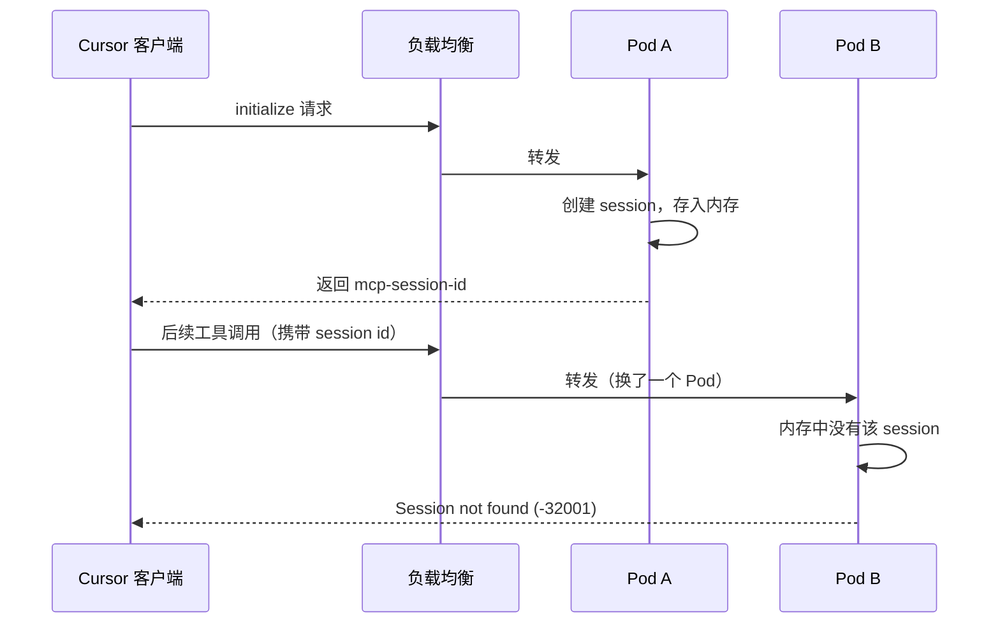

在 K8s 多 Pod 环境下部署 FastMCP httpStream 服务时，遇到了 "Session not found" 错误。排查后发现根因在于 mcp-proxy 的 session 存储机制，最终通过开启 `stateless: true` 一行配置解决。

<!-- more -->

## 一、问题现象

在本地或单实例环境运行 FastMCP httpStream 服务时一切正常，但将服务部署到 K8s 多 Pod 环境后，Cursor 等客户端频繁出现连接失败：

```
[FastMCP info] HTTP Stream session established
[mcp-proxy] establishing new SSE stream for session ID e42e13d5-293c-4939-89be-a1ebe781da3d
```

后续请求报错：`Session not found`（错误码 -32001）

多开几个 Cursor 窗口后问题更加明显，几乎每次都会出现。

## 二、根因分析

FastMCP 的 httpStream 传输层由 `mcp-proxy` 实现，session 存储在**进程内存**中：

```typescript
// mcp-proxy 内部（简化）
activeTransports: Record<string, Transport> = {};
```

在 K8s 多实例环境下，负载均衡会将请求分发到不同 Pod，流程如下：



`mcp-proxy` **不支持自定义 session 存储后端**（如 Redis），`activeTransports` 是硬编码的内存 Record，无法跨 Pod 共享。

## 三、解决方案：启用 Stateless 模式

FastMCP 提供了 `stateless: true` 配置项，在无状态模式下：

- **不生成 `mcp-session-id`**，客户端后续请求也不会携带 session ID
- **每个请求独立处理**：创建临时 transport → 执行工具 → 销毁，不依赖内存 session 映射
- **完全兼容多实例部署**：请求可以被负载均衡分发到任意 Pod

配置改动只需一行：

```typescript
await this._server.start({
    transportType: 'httpStream',
    httpStream: {
        port: this._cfg.port,
        endpoint: this._cfg.endpoint,
        host: '0.0.0.0',
        stateless: true  // 只加这一行
    }
});
```

### 对认证的影响

无状态模式下，`authenticate` 函数**每次请求都会被调用**。如果认证逻辑有较重的 IO 操作（如数据库查询），需要确保认证层有缓存。

我们的项目中，禅道的认证凭证已经缓存在 Redis 中，所以性能没有影响。

### 适用条件

`stateless: true` 适合以下场景：

| 条件 | 说明 |
|------|------|
| 工具都是请求-响应模式 | 不依赖服务端主动推送（SSE push） |
| 已禁用 ping | `ping: false` 或不依赖心跳保活 |
| 认证层有缓存 | 避免每次请求都触发重量级认证 |

我们的 MCP 服务（禅道 Bug 查询、用例操作等）完全符合以上条件。

## 总结

FastMCP httpStream 在 K8s 多实例环境下，因 mcp-proxy 的内存 session 存储无法跨 Pod 共享，导致负载均衡后出现 "Session not found" 错误。解决方案是开启 `stateless: true`，让每个请求独立处理，彻底消除对 session 映射的依赖。

这个配置项在文档里不算显眼，但对于多实例部署来说几乎是必选项。如果你的 FastMCP 服务也跑在 K8s 上，遇到类似问题可以直接试这个方案。

::: info

参考资料：
- [FastMCP 官方文档](https://github.com/modelcontextprotocol/fastmcp)

:::
